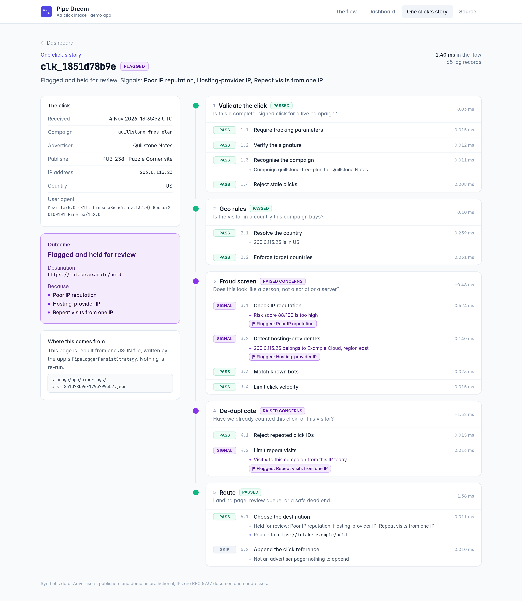

<!-- nav-group: Start here -->
# Introduction

Code for something as complex as tracking email clicks gets complicated fast. It spreads across files, it is hard to read, and it is even harder to question. Ask "why did this request take so long?" or "why wasn't this click accepted?" and the honest answer is usually "let me get an engineer to dig through the logs."

Pipe Dream makes both of those simple. The code reads top to bottom, and every run answers for itself. Here is a click that was accepted:

```text
Click intake · Recorded (4.52 ms)

Accept the click: Is this a real click we can trace back to an ad?
  ✓ RequireClickId          (0.05 ms)
  ✓ ParseUserAgent          (0.11 ms)  Chrome 124 on Windows
  ✓ ResolveGeoIp            (1.58 ms)  US, Austin TX

Filter the junk: Does this look like a person, or a script?
  ✓ IsKnownBot              (0.03 ms)
  ✓ DatacenterIpCheck       (0.04 ms)
  ✓ HeadlessBrowserSignals  (0.02 ms)
  ✓ RateLimitPerFingerprint (0.02 ms)

Attribute: Which campaign gets the credit?
  ✓ MatchToCampaign         (0.31 ms)  Spring Sale · Search
  ✓ DeduplicateWithinWindow (0.12 ms)  First click in the window
  ✓ AssignLastTouch         (0.06 ms)  Credit: Spring Sale · Search

Record & notify: Write the row, update the counters, tell the advertiser
  ✓ WriteClickRow           (0.84 ms)  Row written
  ✓ UpdateCampaignCounters  (0.22 ms)  Clicks +1
  ✓ FirePostback            (1.07 ms)  Advertiser notified, HTTP 200
```

The receipt lists every rule that ran, what it decided and why, and how long it took. A dropped click gets the same receipt. The rule that said no is marked with a ✗ and its reason, and every step after it is marked as skipped. Nobody has to guess where it stopped, or whether the advertiser was told.

You didn't write a single log line to get that. You wrote this:

```php
<?php

use Keaton\PipeDream\PipeHub;
use Keaton\PipeDream\PipeManager;

$envelope = PipeManager::create([

    PipeHub::create()
        ->name('Accept the click')
        ->description('Is this a real click we can trace back to an ad?')
        ->addPipes([
            RequireClickId::class,
            ParseUserAgent::class,
            ResolveGeoIp::class,
        ]),                           // no click id, no click: the flow ends here

    PipeHub::create()
        ->name('Filter the junk')
        ->description('Does this look like a person, or a script?')
        ->addPipes([
            IsKnownBot::class,
            DatacenterIpCheck::class,
            HeadlessBrowserSignals::class,
            RateLimitPerFingerprint::class,
        ])
        ->skipIf(fn ($click) => $click->fromAllowlistedPartner(), 'Allowlisted partner')
        ->then(fn ($click) => $click->botSignals() >= 3 ? $click->drop("{$click->botSignals()} automation signals") : null),

    PipeHub::create()
        ->name('Attribute')
        ->description('Which campaign gets the credit?')
        ->addPipes([
            MatchToCampaign::class,
            DeduplicateWithinWindow::class,
            AssignLastTouch::class,
        ])
        ->skipIf(fn ($click) => $click->isDropped() ? "Dropped: {$click->dropReason}" : null),

    PipeHub::create()
        ->name('Record & notify')
        ->description('Write the row, update the counters, tell the advertiser')
        ->addPipes([
            WriteClickRow::class,
            UpdateCampaignCounters::class,
            FirePostback::class,
        ])
        ->skipIf(fn ($click) => $click->isDropped() ? "Dropped: {$click->dropReason}" : null),

])
    ->name('Click intake')
    ->subject($click)
    ->then(fn ($click) => $click->settle())
    ->sendIt();
```

The whole intake reads top to bottom. Someone new to the code can follow it on the first pass, and so can you when you come back to it months later.

`$envelope->receipt()` gives you the receipt, and the same record is there as data through `$envelope->steps()` and `$envelope->logs()`. Turn on saving once, and every run is stored, ready to pull back later on its own or as part of a group.

## Every run is a row

Every saved run is one row in one table. The row holds the flow's name and what it ran on, whether anything went wrong, and every step with how long it took. Getting runs back is one query:

```php
use Keaton\PipeDream\Models\PipeDreamLog;

// One run, by its id
$receipt = PipeDreamLog::forRun($runId)->first()->receipt();

// Every click intake that had a problem today
$runs = PipeDreamLog::where('flow', 'Click intake')
    ->withProblems()
    ->whereDate('created_at', today())
    ->get();
```

Because the shape is so simple, a dashboard is easy to write: a few queries and a view.

As an example, this page was built from one saved click, and nothing else:



[Saving and replaying runs](09-saving-and-replaying.md) shows how to turn it on and how to find runs.

## Same shape, any business

Click intake is one flow. Here's a completely different one: a checkout, where the question is "why was my order put on hold?" Different business, same pipe, same receipt:

```text
Checkout · On hold: Two or more fraud signals (2.43 ms)

Validate the order: Is this a complete order for items we can actually ship?
  ✓ RequireShippingAddress        (0.14 ms)
  ✓ ConfirmItemsInStock           (1.58 ms)  3 items in stock
  ✓ ApplyDiscountCodes            (0.04 ms)  SPRING20 applied: -$24.00
  ✓ CalculateTax                  (0.01 ms)  Tax: $7.92

Fraud screen: Does this look like the real cardholder?
  ✗ MatchBillingToShippingCountry (0.02 ms)  Billing US, shipping NL
  ✗ CheckCardVelocity             (0.01 ms)  4 cards tried on this account in 10 minutes
  ✓ ScoreDeviceFingerprint        (0.01 ms)

Charge: Take the money, only for orders we will ship · skipped: Order is on hold
  ↷ AuthorizePayment              skipped
  ↷ CapturePayment                skipped

Fulfill: Reserve stock, tell the warehouse, email the receipt · skipped: Order is on hold
  ↷ ReserveInventory              skipped
  ↷ SendToWarehouse               skipped
  ↷ EmailReceipt                  skipped
```

The card was never charged and nothing shipped, so your support team can say so, with receipts. [Your first flow](03-your-first-flow.md) builds this one, one rule at a time.

Loan decisions, KYC onboarding, insurance claims, refunds, content moderation: if it's a series of decisions someone will later ask you to explain, it's a pipe.

## The vocabulary

| Word | Class | What it is |
|---|---|---|
| Flow | `PipeManager` | The whole process: stages, in order. "Click intake" above. |
| Hub | `PipeHub` | One named stage: a list of rules, and how the stage behaves. "Filter the junk". |
| Rule | `PipeRule` | One small class that makes one decision. `IsKnownBot`. |
| Envelope | `PipeEnvelope` | Your object (the click) plus the record of the run. Every rule receives it. |
| Receipt | `Receipt` | What every rule decided and why, read from the envelope. |

## When to use it

Use it for a process that someone will later ask you to explain: a click on an ad, a checkout, a loan decision, a refund.

- The process has stages people can name. A reviewer reads the stage names and the rule names and knows what the code does.
- You have to explain a decision later. Save the run, and the receipt for any click or order can be pulled back from the database.
- The rules change one at a time. Each decision is one class with one test, so the fraud screen can change without touching the charge.

It is not a queue or a workflow engine. A flow runs in order, in one PHP process, and returns its envelope. Run it inside a controller, a queued job or a command.

Two walkthroughs build complete flows: [a click intake](11-click-intake.md), with one request, one saved row and one redirect, and [a checkout](12-checkout-walkthrough.md), built from the same pieces.

**Next:** [Installation](02-installation.md).
